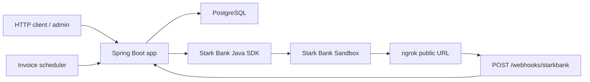
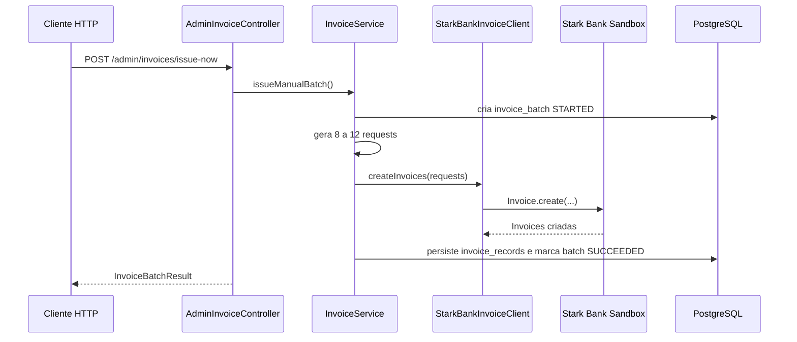
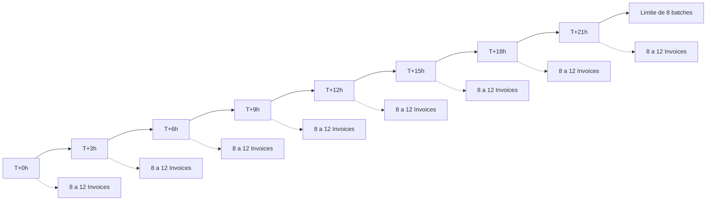
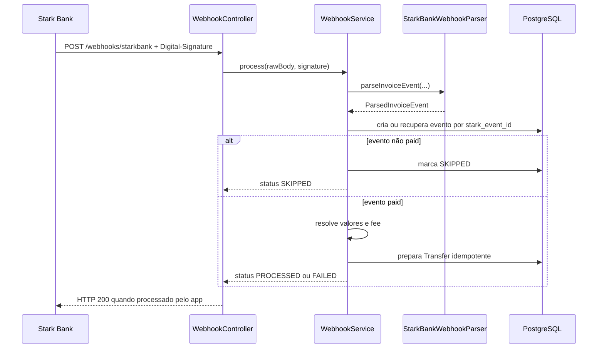
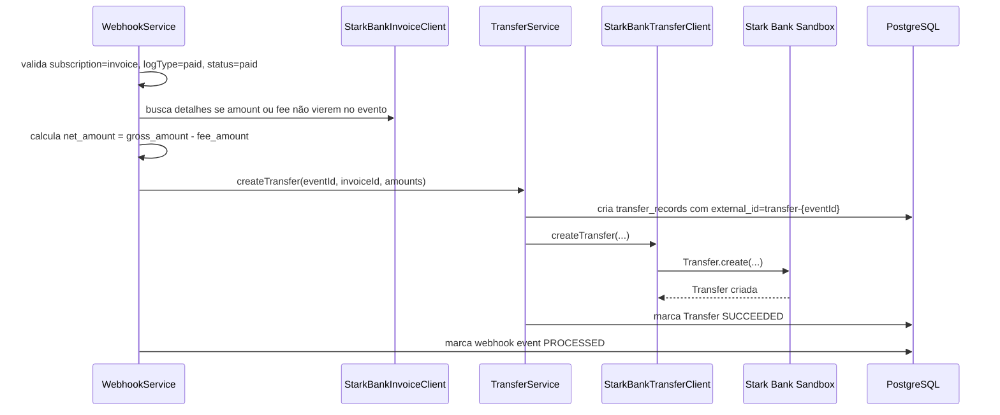
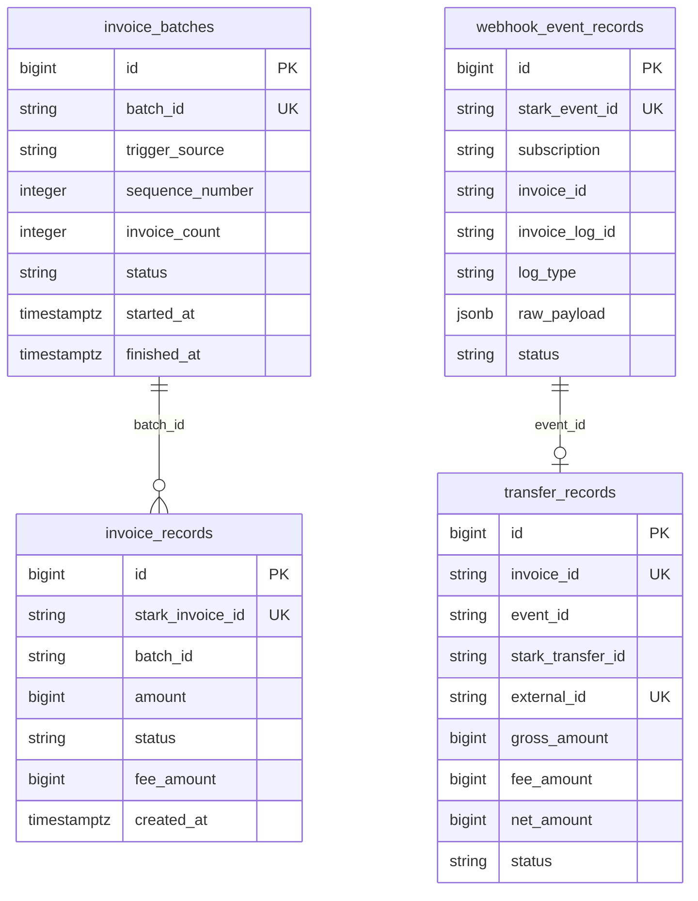

# Stark Bank Backend Trial

Aplicação backend em Java/Spring Boot para o desafio Stark Bank. O serviço emite Invoices no Sandbox, recebe webhooks reais da Stark Bank, persiste os eventos de forma idempotente e implementa o fluxo de criação de Transfer quando uma Invoice é confirmada como paga.

## Visão Geral do Desafio

O desafio pede uma aplicação capaz de:

- Criar de 8 a 12 Invoices a cada 3 horas durante uma janela de até 24 horas.
- Receber eventos de webhook da Stark Bank.
- Validar e interpretar os eventos usando a Stark Bank Java SDK.
- Quando uma Invoice for paga, criar uma Transfer para a conta de destino configurada.
- Registrar o processamento local de forma rastreável e idempotente.

Esta implementação usa o Sandbox da Stark Bank, PostgreSQL local via Docker Compose e Flyway para versionamento do schema. A versão AWS também foi publicada em ECS/Fargate, com RDS PostgreSQL, ECR, Secrets Manager, ALB HTTPS, Route 53, ACM e deploy via GitHub Actions OIDC.

## O Que a Aplicação Faz

- Emite lotes manuais de Invoices pelo endpoint administrativo.
- Emite lotes agendados com limite de 8 execuções, intervalo padrão de 3 horas e 8 a 12 Invoices por lote.
- Gera Invoices com CPF válido sintético, valor aleatório e tags de rastreio.
- Recebe webhook real em `POST /webhooks/starkbank`.
- Exige o header `Digital-Signature` e delega o parsing/validação à Stark Bank Java SDK.
- Persiste todos os eventos recebidos em `webhook_event_records`, incluindo `raw_payload`.
- Marca eventos não pagos como `SKIPPED`.
- Para evento `paid`, calcula `net_amount = gross_amount - fee_amount` e cria Transfer com `external_id` idempotente.
- Disponibiliza endpoints administrativos de consulta para Invoices, batches, webhook events e Transfers.

## Checklist de Funcionalidades

- [x] Java 21 e Spring Boot 3.
- [x] PostgreSQL com Flyway.
- [x] Stark Bank Java SDK.
- [x] Emissão manual de Invoices.
- [x] Scheduler de emissão por até 24 horas.
- [x] Webhook `/webhooks/starkbank`.
- [x] Validação/parsing de webhook pela SDK.
- [x] Persistência idempotente de eventos.
- [x] Skip correto para eventos `created`, `overdue` e `expired`.
- [x] Fluxo `paid -> Transfer` implementado e coberto por testes automatizados.
- [x] Smoke test AWS com webhook real, evento `paid` processado e Transfer criada com status `SUCCEEDED`.

## Stack

- Java 21
- Spring Boot 3.5
- Maven Wrapper
- Spring Web
- Spring Data JPA
- PostgreSQL
- Flyway
- Docker Compose
- Stark Bank Java SDK 2.25.2
- JUnit 5
- Mockito
- Testcontainers

## Arquitetura

A documentação detalhada da aplicação está em [docs/architecture.md](docs/architecture.md).
O capítulo específico da versão AWS está em [docs/aws-architecture.md](docs/aws-architecture.md), com operação de deploy em [docs/aws-deployment.md](docs/aws-deployment.md).



Principais responsabilidades:

- `interfaces.web`: controllers HTTP.
- `application.invoice`: emissão manual/agendada de Invoices.
- `application.webhook`: processamento de eventos, idempotência e Transfer.
- `infrastructure.starkbank`: adaptação da Stark Bank Java SDK.
- `infrastructure.persistence`: entidades e repositories JPA.
- `config`: propriedades de Stark Bank, scheduler e destino da Transfer.

## Fluxos Principais

### Emissão Manual de Invoices



### Scheduler de 24 Horas



O scheduler usa `invoice.scheduler.interval-hours`, com valor padrão vindo de `INVOICE_INTERVAL_HOURS=3`, e para após `invoice.scheduler.max-batches`, com valor padrão vindo de `INVOICE_MAX_BATCHES=8`.

### Processamento de Webhook



### Invoice Paga para Transfer



## Pré-requisitos

- Java 21
- Docker e Docker Compose
- Git
- Conta/projeto Stark Bank Sandbox
- Private key do projeto Sandbox
- ngrok ou ferramenta equivalente para expor `localhost:8080` à Stark Bank

## Variáveis de Ambiente

Os nomes abaixo foram conferidos em `application.yml`, nas classes `@ConfigurationProperties` e em `.env.example`.

| Propriedade Spring | Variável usada pelo projeto | Obrigatória | Observação |
| --- | --- | --- | --- |
| `server.port` | `SERVER_PORT` | Não | Porta HTTP local, padrão `8080`. |
| `spring.datasource.url` | `DATABASE_URL` | Não | URL JDBC do PostgreSQL. |
| `spring.datasource.username` | `DATABASE_USERNAME` | Não | Usuário do PostgreSQL local. |
| `spring.datasource.password` | `DATABASE_PASSWORD` | Não | Senha do PostgreSQL local. |
| `starkbank.environment` | `STARKBANK_ENVIRONMENT` | Sim | Use `sandbox` para o desafio. |
| `starkbank.project-id` | `STARKBANK_PROJECT_ID` | Sim | ID do projeto Stark Bank Sandbox. |
| `starkbank.private-key-path` | `STARKBANK_PRIVATE_KEY_PATH` | Sim, se `STARKBANK_PRIVATE_KEY` não for usado | Caminho para a private key local. Não versionar arquivos de chave privada. |
| `starkbank.private-key` | `STARKBANK_PRIVATE_KEY` | Sim, se `STARKBANK_PRIVATE_KEY_PATH` não for usado | Alternativa inline; evite em shell history e CI logs. |
| `invoice.scheduler.enabled` | `INVOICE_SCHEDULER_ENABLED` | Não | Habilita/desabilita scheduler. |
| `invoice.scheduler.interval-hours` | `INVOICE_INTERVAL_HOURS` | Não | Intervalo em horas entre batches. |
| `invoice.scheduler.max-batches` | `INVOICE_MAX_BATCHES` | Não | Limite de batches agendados. |
| `starkbank.transfer.destination.bank-code` | `STARKBANK_TRANSFER_DESTINATION_BANK_CODE` | Não | Banco de destino da Transfer. |
| `starkbank.transfer.destination.branch-code` | `STARKBANK_TRANSFER_DESTINATION_BRANCH_CODE` | Não | Agência de destino. |
| `starkbank.transfer.destination.account-number` | `STARKBANK_TRANSFER_DESTINATION_ACCOUNT_NUMBER` | Não | Conta de destino. |
| `starkbank.transfer.destination.name` | `STARKBANK_TRANSFER_DESTINATION_NAME` | Não | Nome do favorecido. |
| `starkbank.transfer.destination.tax-id` | `STARKBANK_TRANSFER_DESTINATION_TAX_ID` | Não | Documento do favorecido. |
| `starkbank.transfer.destination.account-type` | `STARKBANK_TRANSFER_DESTINATION_ACCOUNT_TYPE` | Não | Tipo da conta, por exemplo `payment`. |

Use `.env.example` como base e mantenha `.env` e arquivos de chave privada fora do Git.

## Como Rodar os Testes

```bash
./mvnw test
```

Os testes usam JUnit/Mockito e Testcontainers para validar persistência com PostgreSQL.

## Como Rodar Localmente

Suba o PostgreSQL:

```bash
docker compose up -d postgres
```

Configure as variáveis Stark Bank Sandbox. Exemplo com private key por arquivo:

```bash
export STARKBANK_ENVIRONMENT=sandbox
export STARKBANK_PROJECT_ID=project-id-from-sandbox
export STARKBANK_PRIVATE_KEY_PATH=path/to/private-key-file
```

Inicie a aplicação:

```bash
./mvnw spring-boot:run
```

Verifique a saúde:

```bash
curl http://localhost:8080/health
```

## PostgreSQL

O `docker-compose.yml` sobe um PostgreSQL 16 Alpine em `localhost:5432`, com banco local `starkbank_trial`.

Consultar tabelas principais:

```bash
docker compose exec -T postgres psql -U starkbank -d starkbank_trial -c "select batch_id, trigger_source, sequence_number, status, invoice_count from invoice_batches order by started_at desc limit 10;"
docker compose exec -T postgres psql -U starkbank -d starkbank_trial -c "select stark_invoice_id, batch_id, amount, status, fee_amount from invoice_records order by created_at desc limit 10;"
docker compose exec -T postgres psql -U starkbank -d starkbank_trial -c "select stark_event_id, invoice_id, log_type, status from webhook_event_records order by received_at desc limit 10;"
docker compose exec -T postgres psql -U starkbank -d starkbank_trial -c "select invoice_id, event_id, external_id, status, net_amount from transfer_records order by created_at desc limit 10;"
```

## Stark Bank Sandbox

Configure um projeto Sandbox e a private key correspondente. O app aceita private key por caminho (`STARKBANK_PRIVATE_KEY_PATH`) ou conteúdo inline (`STARKBANK_PRIVATE_KEY`). O caminho local é preferível para evitar vazamento em histórico de shell.

Pontos importantes:

- `STARKBANK_PROJECT_ID` deve ser o ID do projeto, não o workspace nem um Access-Id avulso.
- `STARKBANK_ENVIRONMENT` deve ser `sandbox` ou `production`; para o desafio, use `sandbox`.
- Arquivos de chave privada estão ignorados pelo Git e não devem ser versionados.

## Webhook e ngrok

Para desenvolvimento local, exponha a aplicação local:

```bash
ngrok http 8080
```

Cadastre a URL pública no Sandbox apontando para:

```text
https://your-ngrok-domain.example/webhooks/starkbank
```

Sempre que a URL pública mudar, atualize o webhook no Sandbox. Webhooks reais precisam do header `Digital-Signature`; chamadas manuais sem assinatura válida devem retornar `400`.

Para AWS, ngrok é apenas fallback/local. O endpoint final da Stark deve usar HTTPS no domínio da AWS:

```text
https://starkbank-trial.tavares-dev.com.br/webhooks/starkbank
```

O HTTP do ALB serve apenas para smoke test técnico ou redirect para HTTPS. Antes de habilitar o scheduler AWS, confirme app saudável, `/health` via HTTPS, RDS/Flyway, secrets, webhook apontando para AWS, app local parado ou isolado, apenas uma task ECS ativa e `INVOICE_MAX_BATCHES=8`.

Não mantenha local/ngrok e AWS processando webhooks ao mesmo tempo, nem duas subscriptions `invoice` ativas na Stark apontando para ambientes diferentes durante a bateria. Para rollback, desligue primeiro o scheduler via nova task definition/workflow, mantenha a task viva para eventos pendentes, escale ECS para `0` só depois que os eventos cessarem e restaure o webhook para local/ngrok apenas se necessário.

## Endpoints Administrativos

| Método | Endpoint | Descrição |
| --- | --- | --- |
| `GET` | `/health` | Healthcheck simples da aplicação. |
| `POST` | `/admin/invoices/issue-now` | Emite um lote manual de 8 a 12 Invoices. |
| `GET` | `/admin/invoices` | Lista as 50 Invoices locais mais recentes. |
| `GET` | `/admin/invoice-batches` | Lista os 50 batches locais mais recentes. |
| `POST` | `/webhooks/starkbank` | Recebe webhook real da Stark Bank. |
| `GET` | `/admin/webhook-events` | Lista os 50 eventos de webhook locais mais recentes. |
| `GET` | `/admin/transfers` | Lista as 50 Transfers locais mais recentes. |

Exemplos HTTP estão em [docs/requests/starkbank-trial.http](docs/requests/starkbank-trial.http).

## Scheduler

O scheduler fica em `InvoiceIssuingScheduler` e usa:

- `invoice.scheduler.enabled`, via `INVOICE_SCHEDULER_ENABLED`.
- `invoice.scheduler.interval-hours`, via `INVOICE_INTERVAL_HOURS`.
- `invoice.scheduler.max-batches`, via `INVOICE_MAX_BATCHES`.

O padrão do projeto é executar a cada 3 horas e parar após 8 batches agendados. Cada batch gera de 8 a 12 Invoices. A geração de Invoice usa `due` aproximadamente 2 horas no futuro e `expiration` de 24 horas; estes valores fazem parte do comportamento atual e não foram alterados nesta etapa de documentação.

Scheduling é habilitado por `@EnableScheduling` em `InvoiceIssuingConfig`. Em validações locais, `INVOICE_SCHEDULER_ENABLED=false` desativa a emissão automática mesmo que a tarefa esteja registrada no contexto Spring. Como o intervalo é medido em horas, a validação automatizada não espera 3 horas: os testes verificam a configuração do scheduler, os defaults e o fluxo de sequência/limite dos batches agendados.

Para uma execução cloud com scheduler habilitado, mantenha apenas uma task/instância ativa. Se a aplicação for escalada horizontalmente no futuro, desabilite o scheduler nas réplicas ou adicione lock distribuído antes de permitir mais de uma instância emitindo batches.

## Modelo de Persistência



## Idempotência

- Batches agendados usam `trigger_source=SCHEDULED` e `sequence_number` único.
- Invoices locais usam `stark_invoice_id` único quando a Stark retorna o ID.
- Webhook events usam `stark_event_id` único.
- Transfers usam `invoice_id` e `external_id` únicos.
- O `external_id` da Transfer é derivado como `transfer-{eventId}`.
- Duplicatas já processadas retornam resposta idempotente sem recriar Transfer.

## Tratamento de Erros

- Webhook sem `Digital-Signature` retorna `400`.
- Payload ausente ou JSON inválido retorna `400`.
- Assinatura inválida retorna `400`.
- Subscription diferente de Invoice retorna `400`.
- Evento já processado ou já ignorado retorna resposta de duplicidade controlada.
- Falha ao criar Transfer marca o registro local como `FAILED`, preservando o erro resumido.

## Cálculo do Valor da Transfer

Para evento `paid`, o app tenta obter:

- `gross_amount`: valor recebido da Invoice.
- `fee_amount`: fee da Invoice.
- `net_amount`: `gross_amount - fee_amount`.

Se o evento não trouxer todos os valores, o app consulta detalhes da Invoice pela SDK. A Transfer só é criada se os valores forem conhecidos e `net_amount > 0`.

## Status de Validação

Detalhes estão em [docs/VALIDATION.md](docs/VALIDATION.md).

Resumo da validação local anterior:

- Criação de Invoices foi validada no Sandbox.
- Webhook real foi validado com eventos `created`, `overdue` e `expired`.
- Foram persistidos 45 eventos locais: `created=26`, `overdue=18`, `expired=1`, `paid=0`.
- Todos os eventos consultados na Stark Bank estavam com `isDelivered=true`.
- Os eventos recebidos foram processados pela aplicação com HTTP 200.
- Uma validação noturna adicional confirmou o scheduler em execução real, com 52 Invoices scheduled bem-sucedidas distribuídas entre batches de 8 a 12 Invoices.
- Nenhuma Transfer foi criada nessa janela porque nenhum evento/log `paid` foi gerado durante a observação local.
- O fluxo `paid -> Transfer` estava implementado e coberto por testes automatizados.

Resumo da validação AWS:

- Aplicação publicada em ECS/Fargate com RDS PostgreSQL, ECR, Secrets Manager, ALB HTTPS, Route 53 e ACM.
- `/health` respondeu HTTP 200 pelo domínio `starkbank-trial.tavares-dev.com.br`.
- Webhook real foi recebido em `https://starkbank-trial.tavares-dev.com.br/webhooks/starkbank`.
- Evento `paid` foi processado e a Transfer correspondente foi criada com status `SUCCEEDED`.
- Scheduler AWS configurado para 8 batches, intervalo de 3 horas e ativação controlada por `INVOICE_SCHEDULER_ENABLED`.

Detalhes da versão AWS estão em [docs/aws-architecture.md](docs/aws-architecture.md).

## Limitação Observada no Sandbox

Durante a janela local testada, as Invoices criadas no Sandbox não transicionaram para `paid`. Uma Invoice manual criada pelo portal como cobrança imediata, ID mascarado `46628325...0944`, também seguiu `created -> overdue -> expired`, sem evento/log `paid`.

Isso é documentado como comportamento observado e pendência de validação externa, não como bug confirmado da Stark Bank.

## Troubleshooting

Guia completo em [docs/troubleshooting.md](docs/troubleshooting.md).

Atalhos úteis:

- Erro de credencial geralmente envolve `STARKBANK_PROJECT_ID`, private key incorreta ou `STARKBANK_ENVIRONMENT`.
- Erro de `Access-Id` costuma indicar Project ID ou chave não compatíveis.
- Webhook sem `Digital-Signature` deve falhar.
- URL ngrok alterada exige atualização do webhook no Sandbox.
- Ausência de `paid` no Sandbox não implica falha automática do app; compare eventos entregues, logs da Stark e registros locais.

## Trade-offs

- O app usa endpoints administrativos sem autenticação porque o foco do desafio é integração Stark Bank; para produção, autenticação/autorização devem ser adicionadas.
- O schema preserva `raw_payload` do webhook em JSONB para auditoria, com custo de armazenamento maior.
- A idempotência é implementada no banco por chaves únicas, simplificando concorrência.
- O uso de `Settings.user` pela SDK antes do parse é isolado no provider, mas continua sendo um ponto de atenção por envolver estado global da SDK.
- Observabilidade foi mantida simples nesta entrega; métricas customizadas e tracing ficam como próximos passos.

## Bônus e Melhorias Futuras

- AWS operations: manter a documentação de arquitetura e operação em [docs/aws-architecture.md](docs/aws-architecture.md) e [docs/aws-deployment.md](docs/aws-deployment.md).
- SDK/API findings: documentar pontos que exigem confirmação antes de abrir issue pública.
- Documentation gaps: registrar dúvidas operacionais sobre `paid`, `due`, `expiration`, fee e payment details.
- Sandbox behavior observed: manter evidência de Invoices que expiraram sem `paid`.
- Candidate improvement: adicionar Actuator, métricas, dashboards, logs estruturados e alertas.

Achados exploratórios estão em [docs/starkbank-findings.md](docs/starkbank-findings.md).

## Notas de Submissão

- Não há secrets reais no repositório.
- O arquivo `.env.example` contém apenas nomes e placeholders.
- A private key deve permanecer fora do Git.
- O fluxo principal de criação de Invoices e recepção de webhooks reais foi validado.
- O fluxo `paid -> Transfer` está implementado, coberto por testes e validado em smoke test AWS com evento `paid` real e Transfer `SUCCEEDED`.
