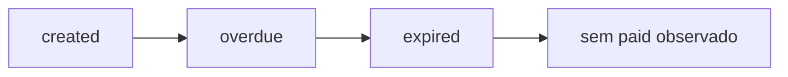

# Validação

Este documento registra o que foi validado no Sandbox da Stark Bank e o que permanece pendente por depender de um evento real `paid`.

## Resumo Executivo

- A criação de Invoices foi validada no Sandbox.
- O webhook real foi validado com eventos `created`, `overdue` e `expired`.
- Todos os eventos recebidos pela aplicação foram processados com HTTP 200.
- Todos os eventos consultados via SDK na Stark Bank estavam com `isDelivered=true`.
- O scheduler foi validado em execução real durante uma janela noturna, com batches `SCHEDULED` bem-sucedidos e emissão de 52 Invoices.
- O fluxo `paid -> Transfer` está implementado e coberto por testes automatizados.
- O fluxo `paid -> Transfer` não foi validado end-to-end no Sandbox porque nenhum evento/log `paid` foi gerado durante a janela observada.
- Nenhuma Transfer foi criada porque não houve evento `paid`.

## Dados Observados

Eventos locais persistidos:

| Tipo de log | Quantidade |
| --- | ---: |
| `created` | 26 |
| `overdue` | 18 |
| `expired` | 1 |
| `paid` | 0 |
| Total | 45 |

Transfers:

| Métrica | Quantidade |
| --- | ---: |
| Transfers criadas | 0 |

## Validação Adicional do Scheduler

Uma execução noturna com o scheduler habilitado confirmou que a emissão agendada funciona em ambiente local integrado ao Sandbox da Stark Bank.

Condições observadas:

- Aplicação `UP` em `http://localhost:18080`.
- Túnel ngrok ativo em `https://juniper-mammary-stalemate.ngrok-free.dev`.
- `http_count=118` no diagnóstico do túnel.

### Batches Scheduled Observados

| Sequence | Status | Invoices | Horário observado |
| ---: | --- | ---: | --- |
| 1 | `FAILED` | 0 | 2026-06-21 18:34:37 BRT |
| 2 | `FAILED` | 0 | 2026-06-21 18:53:48 BRT |
| 3 | `SUCCEEDED` | 11 | 2026-06-21 18:55:31 BRT |
| 4 | `SUCCEEDED` | 8 | 2026-06-21 23:10:20 BRT |
| 5 | `SUCCEEDED` | 12 | 2026-06-22 02:10:19 BRT |
| 6 | `SUCCEEDED` | 9 | 2026-06-22 05:10:19 BRT |
| 7 | `SUCCEEDED` | 12 | 2026-06-22 08:10:18 BRT |

As duas primeiras sequências falharam durante ajustes de configuração. A sequência 3 foi a primeira emissão agendada bem-sucedida.

### Intervalos Observados

| Intervalo | Duração |
| --- | --- |
| sequence 1 -> sequence 2 | 19min 11s |
| sequence 2 -> sequence 3 | 1min 43s |
| sequence 3 -> sequence 4 | 4h 14min 48s |
| sequence 4 -> sequence 5 | 2h 59min 59s |
| sequence 5 -> sequence 6 | 2h 59min 59s |
| sequence 6 -> sequence 7 | 2h 59min 59s |

O intervalo entre as sequências 3 e 4 foi afetado por pausa/sleep do Mac, com logs indicando `Thread starvation or clock leap detected`. Após estabilização, os intervalos observados ficaram coerentes com a configuração de 3 horas.

### Invoices Scheduled Bem-Sucedidas

Foram emitidas 52 Invoices em batches `SCHEDULED` bem-sucedidos:

| Sequence | Invoices |
| ---: | ---: |
| 3 | 11 |
| 4 | 8 |
| 5 | 12 |
| 6 | 9 |
| 7 | 12 |
| Total | 52 |

A contagem em `invoice_batches.invoice_count` bateu com os registros correspondentes em `invoice_records`.

Além dos dados reais, uma simulação local de 100 chamadas da factory, sem Stark Bank e sem banco de dados, confirmou distribuição variada dentro do intervalo esperado de 8 a 12 Invoices:

| Quantidade gerada | Frequência |
| ---: | ---: |
| 8 | 19 |
| 9 | 20 |
| 10 | 22 |
| 11 | 16 |
| 12 | 23 |

### Webhooks das Invoices Scheduled

Eventos observados para as 52 Invoices scheduled bem-sucedidas:

| Tipo de evento | Quantidade |
| --- | ---: |
| `created` | 52 |
| `overdue` | 40 |
| `paid` | 0 |
| `expired` | 0 |
| Transfers criadas | 0 |

Conclusão da validação adicional:

- O scheduler foi validado em execução real.
- As emissões scheduled funcionaram após estabilização da configuração.
- A quantidade aleatória entre 8 e 12 Invoices foi validada por dados reais e simulação local.
- Eventos `created` chegaram para todas as Invoices scheduled bem-sucedidas.
- Nenhum evento/log `paid` foi gerado pelo Sandbox durante a janela observada.
- Nenhuma Transfer foi criada corretamente, pois não houve evento `paid`.

## O Que Foi Validado

### Criação de Invoices

O app criou Invoices com sucesso no Sandbox usando a Stark Bank Java SDK. Os registros locais foram persistidos em `invoice_records` e associados aos batches em `invoice_batches`.

Validações cobertas:

- Criação de lotes com 8 a 12 Invoices.
- Persistência de batch e Invoices locais.
- Status local inicial das Invoices.
- Uso de tags para rastrear batch e origem.
- Tratamento de falha de criação de batch.

### Webhook Real

O endpoint `POST /webhooks/starkbank` recebeu webhooks reais encaminhados pela Stark Bank via URL pública de túnel.

Validações cobertas:

- Recebimento de payload real.
- Presença e uso do header `Digital-Signature`.
- Parsing/validação via Stark Bank Java SDK.
- Persistência idempotente por `stark_event_id`.
- Persistência do `raw_payload` em JSONB.
- Skip correto para eventos não pagos.
- Resposta HTTP 200 para eventos processados pela aplicação.

### Eventos Não Pagos

Eventos `created`, `overdue` e `expired` foram tratados como esperados:

- O evento foi persistido.
- O app identificou que não era um evento `paid`.
- O status local foi marcado como `SKIPPED`.
- Nenhuma Transfer foi criada.
- A Stark Bank recebeu HTTP 200 para os eventos processados.

### Entrega de Eventos na Stark Bank

Os eventos consultados via SDK na Stark Bank estavam com `isDelivered=true`. Isso indica que, para os eventos consultados, a entrega ao webhook ocorreu com sucesso.

## Invoice Manual pelo Portal

Uma Invoice manual criada pelo portal como cobrança imediata, ID `4662832549330944`, também foi observada.

Sequência observada:



Essa Invoice também não gerou evento/log `paid` durante a janela observada.

## Fluxo Paid para Transfer

O fluxo está implementado para eventos que atendam simultaneamente às condições:

- `subscription=invoice`
- `logType=paid`
- `status=paid`

Quando essas condições forem atendidas, o app:

1. Persiste o evento de forma idempotente.
2. Resolve `gross_amount` e `fee_amount`.
3. Calcula `net_amount = gross_amount - fee_amount`.
4. Cria uma Transfer com `external_id=transfer-{eventId}`.
5. Marca o evento como `PROCESSED` se a Transfer for criada com sucesso.

Esse fluxo está coberto por testes automatizados, mas não foi validado end-to-end no Sandbox porque nenhum evento/log `paid` foi gerado.

## Limitação Observada no Sandbox

Durante a janela de validação:

- Invoices criadas pela aplicação chegaram a `created` e `overdue`.
- Pelo menos uma Invoice chegou a `expired`.
- A Invoice manual `4662832549330944` também seguiu `created -> overdue -> expired`.
- Nenhuma Invoice observada gerou evento/log `paid`.
- Nenhuma Transfer foi criada.

Este é um comportamento observado do Sandbox durante a janela testada. Não é tratado aqui como bug confirmado da Stark Bank.

## Como Revalidar Quando Houver Paid

Quando o Sandbox gerar um evento `paid`, validar:

1. A Stark Bank entrega o webhook com HTTP 200.
2. `webhook_event_records` contém o evento com `log_type=paid`.
3. O evento foi marcado como `PROCESSED`.
4. `transfer_records` contém uma Transfer para o `invoice_id`.
5. `external_id` segue o padrão `transfer-{eventId}`.
6. `gross_amount`, `fee_amount` e `net_amount` estão consistentes.
7. `stark_transfer_id` foi preenchido quando a SDK retornou sucesso.
8. Reenvio do mesmo evento não cria uma segunda Transfer.

Consultas úteis:

```sql
select log_type, status, count(*)
from webhook_event_records
group by log_type, status
order by log_type, status;

select invoice_id, event_id, external_id, status, gross_amount, fee_amount, net_amount
from transfer_records
order by created_at desc;
```

## Status Final da Validação

| Área | Status |
| --- | --- |
| Criação de Invoices no Sandbox | Validado |
| Webhook real com `created` | Validado |
| Webhook real com `overdue` | Validado |
| Webhook real com `expired` | Validado |
| Entrega de eventos consultados com `isDelivered=true` | Validado |
| Skip de eventos não pagos | Validado |
| Persistência idempotente de eventos | Validado localmente e por testes |
| Implementação de `paid -> Transfer` | Implementada e testada |
| Validação end-to-end `paid -> Transfer` no Sandbox | Pendente |
| Transfer criada no Sandbox | Não ocorreu, pois não houve `paid` |
