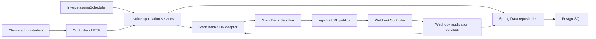
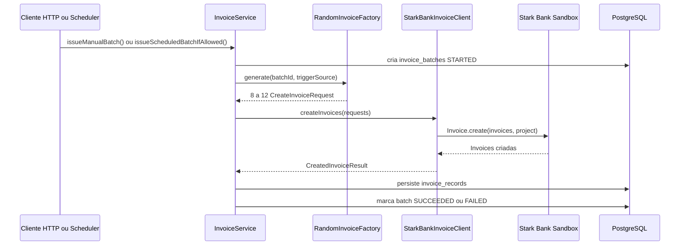
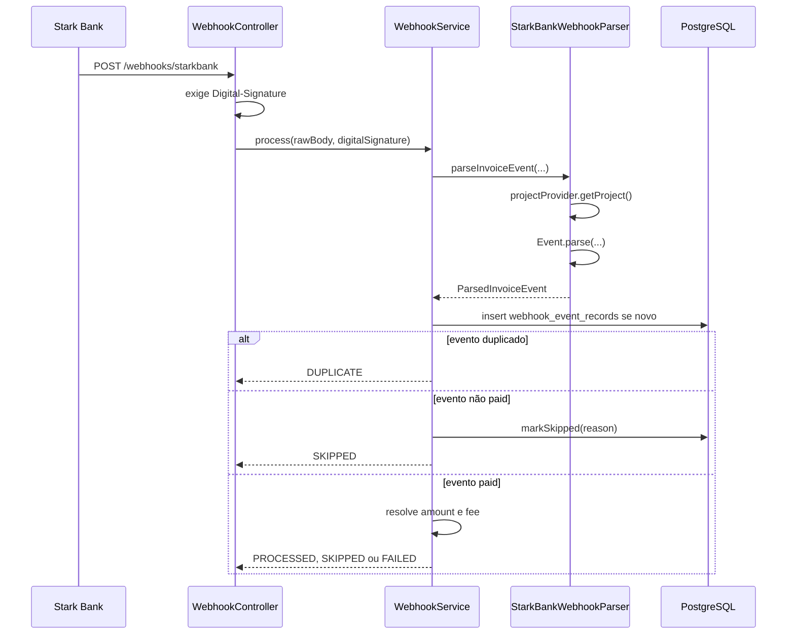
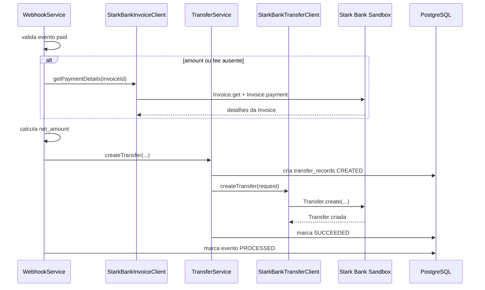
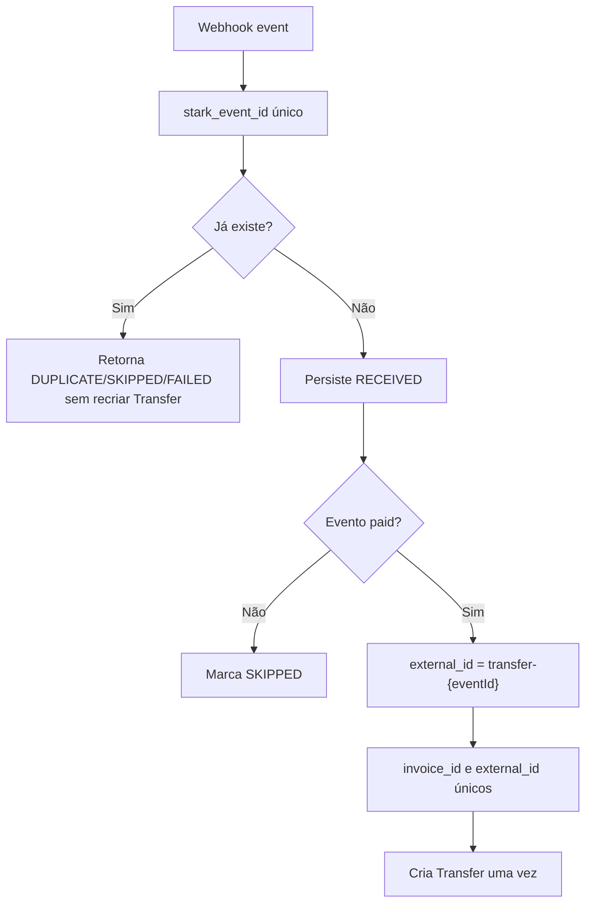
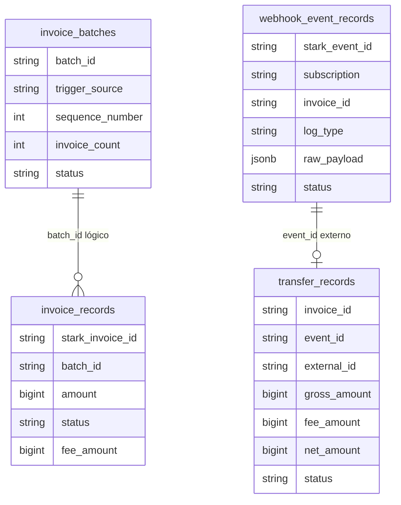
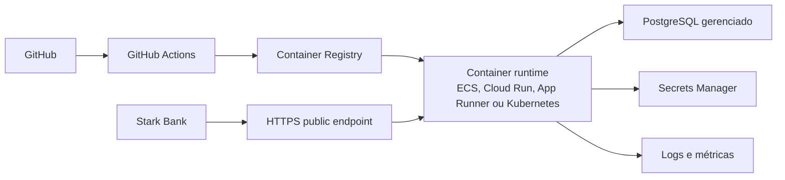

# Arquitetura

Este documento detalha a organização técnica do Stark Bank Backend Trial. Ele descreve a arquitetura atual, os fluxos principais, a integração com a Stark Bank Java SDK, decisões de idempotência, persistência e uma proposta de evolução para cloud deployment.

## Visão Geral

A aplicação segue uma separação simples em camadas:

- Interface HTTP: entrada de requests administrativos e webhook.
- Application services: regras de orquestração de Invoice, Webhook e Transfer.
- Infrastructure: persistência JPA e adaptação da Stark Bank Java SDK.
- Config: propriedades externas e scheduling.

## Responsabilidades por Pacote

| Pacote | Responsabilidade |
| --- | --- |
| `interfaces.web` | Controllers HTTP, status codes e envelopes de resposta. |
| `application.invoice` | Emissão manual/agendada, geração aleatória de Invoices e controle de batches. |
| `application.webhook` | Validação funcional de eventos, idempotência, resolução de valores e criação de Transfer. |
| `infrastructure.starkbank` | Wrapper da Stark Bank Java SDK, criação de Project, parsing de Event, criação de Invoice e Transfer. |
| `infrastructure.persistence` | Entidades JPA, enums e repositories. |
| `config` | `@ConfigurationProperties`, scheduler e configuração da SDK. |

## Fluxo de Emissão de Invoices

O scheduler chama o mesmo serviço usado pelo endpoint manual. A diferença é que batches agendados recebem `sequence_number` e são limitados por `invoice.scheduler.max-batches`.

## Fluxo de Webhook

O app considera pago apenas evento com `subscription=invoice`, `logType=paid` e `status=paid`.

## Fluxo Paid Invoice para Transfer

## Integração com Stark Bank SDK

A integração está isolada em:

- `StarkBankProjectProvider`: cria `Project`, valida environment e carrega private key por path ou conteúdo inline.
- `StarkBankSdkGateway`: encapsula chamadas estáticas da SDK para facilitar testes.
- `StarkBankInvoiceClient`: cria Invoices e busca detalhes de pagamento.
- `StarkBankWebhookParser`: chama `Event.parse(rawBody, digitalSignature)` e converte para `ParsedInvoiceEvent`.
- `StarkBankTransferClient`: cria Transfer com dados de destino configurados.

O provider chama `Settings.user = project` antes de retornar o Project. Isso é importante para o parse de webhook pela SDK e está documentado como ponto de atenção em [starkbank-findings.md](starkbank-findings.md).

## Segurança do Webhook

O endpoint real é `POST /webhooks/starkbank`.

Controles atuais:

- Rejeita requests sem header `Digital-Signature`.
- Rejeita payload ausente ou JSON inválido.
- Usa `Event.parse` da Stark Bank Java SDK para validar assinatura e payload.
- Aceita apenas eventos de Invoice.
- Persiste o payload recebido para auditoria.

Controles recomendados para produção:

- HTTPS obrigatório.
- Autenticação/allowlist na borda se compatível com o provedor.
- Rate limiting.
- Logs estruturados sem payload sensível.
- Alertas para volume anormal de falhas de assinatura.

## Idempotência

Chaves principais:

- `invoice_batches.batch_id` único.
- `invoice_batches.sequence_number` único para `SCHEDULED`.
- `invoice_records.stark_invoice_id` único.
- `webhook_event_records.stark_event_id` único.
- `transfer_records.invoice_id` único.
- `transfer_records.external_id` único.

## Transações

O projeto usa `TransactionTemplate` para separar operações locais importantes:

- Criar batch como `STARTED`.
- Persistir invoices e finalizar batch.
- Criar evento de webhook de forma idempotente.
- Atualizar status de evento.
- Criar e atualizar Transfer.

Chamadas externas à Stark Bank não ficam dentro de uma única transação longa de banco. A aplicação registra estado local antes/depois e preserva falhas para auditoria.

## Persistência

O schema é gerenciado por Flyway e validado pelo Hibernate com `ddl-auto: validate`.

## Proposta de Deploy Cloud

Proposta mínima:

- Gerar imagem Docker da aplicação.
- Publicar em registry privado.
- Usar PostgreSQL gerenciado.
- Armazenar `STARKBANK_PROJECT_ID` e private key em secrets manager.
- Expor endpoint HTTPS estável para webhook.
- Rodar Flyway no startup controlado ou etapa de deploy.
- Adicionar healthcheck e logs estruturados.

## Observabilidade Futura

Melhorias candidatas:

- Spring Boot Actuator com endpoints seguros.
- Métricas para batches, invoices emitidas, eventos por status, Transfers criadas/falhas e latência de chamadas Stark.
- Dashboard Prometheus/Grafana.
- Alertas para falha de webhook, assinatura inválida, ausência prolongada de eventos e falha de Transfer.
- Correlation IDs com `batchId`, `invoiceId`, `eventId` e `externalId`.
- Tracing distribuído se a aplicação for implantada em ambiente com múltiplos serviços.
