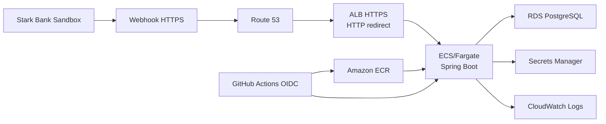
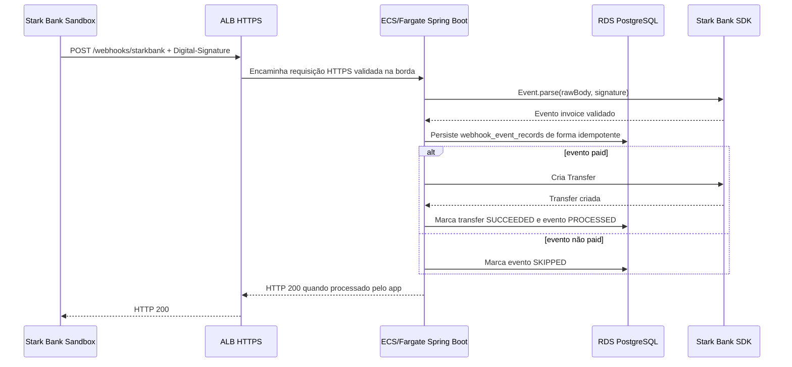

# Arquitetura AWS

Este capítulo documenta a versão AWS do Stark Bank Backend Trial, incluindo arquitetura, fluxo de requisições, decisões técnicas, trade-offs, operação, segurança e evidências de execução. O objetivo é registrar o ambiente publicado sem expor secrets, private keys, tokens, Project ID completo ou IDs sensíveis completos.

## Visão Geral

A versão AWS publica a aplicação Java 21 / Spring Boot 3 em ECS/Fargate, com imagem Docker armazenada no Amazon ECR, banco Amazon RDS PostgreSQL e credenciais sensíveis no AWS Secrets Manager. O webhook público da Stark Bank usa domínio próprio com HTTPS:

```text
https://starkbank-trial.tavares-dev.com.br/webhooks/starkbank
```

Componentes principais:

- Route 53: hosted zone pública de `tavares-dev.com.br` e alias do subdomínio da aplicação para o ALB.
- AWS Certificate Manager: certificado TLS para `starkbank-trial.tavares-dev.com.br`.
- Application Load Balancer: entrada pública HTTPS, com HTTP redirecionando para HTTPS.
- ECS/Fargate: execução do container Spring Boot sem gerenciar instâncias EC2.
- Amazon ECR: registry privado da imagem Docker publicada pelo workflow.
- Amazon RDS PostgreSQL: persistência relacional para batches, invoices, webhook events e transfers.
- AWS Secrets Manager: armazenamento de credenciais Stark Bank e senha do banco.
- CloudWatch Logs: logs da aplicação e da task ECS.
- GitHub Actions OIDC: deploy sem AWS access keys persistentes no GitHub.



## Fluxo de Requisição

O caminho validado para webhooks reais é:

1. A Stark Bank Sandbox envia um evento para o webhook HTTPS cadastrado no Project AWS.
2. O DNS do Route 53 resolve `starkbank-trial.tavares-dev.com.br` para o ALB.
3. O ALB recebe a requisição em HTTPS e encaminha para a task ECS/Fargate.
4. A aplicação Spring Boot recebe `POST /webhooks/starkbank`.
5. O endpoint exige o header `Digital-Signature` e delega o parse/validação para a Stark Bank Java SDK.
6. O evento é persistido no RDS PostgreSQL com idempotência por `stark_event_id`.
7. Para evento `paid`, a aplicação calcula o valor líquido e cria uma Transfer pela Stark Bank SDK.
8. O resultado da Transfer é registrado no RDS.



## Separação Local vs AWS

Os ambientes local e AWS foram mantidos separados para evitar duplicidade de eventos e facilitar auditoria:

- Local usa banco PostgreSQL local, normalmente via Docker Compose.
- Local usa ngrok ou URL equivalente para expor `localhost` durante desenvolvimento.
- AWS usa domínio próprio HTTPS, ALB, ECS/Fargate e RDS PostgreSQL.
- O Project Stark da AWS é separado do Project usado localmente.
- O webhook ngrok foi removido do Project AWS para evitar que o mesmo evento fosse entregue para dois ambientes.
- A idempotência é garantida por banco/ambiente. Como local e AWS usam bancos diferentes, o mesmo evento entregue aos dois ambientes seria processado independentemente.

Durante a bateria AWS, mantenha apenas o webhook HTTPS da AWS ativo para a subscription `invoice` do Project AWS. Não deixe local/ngrok e AWS processando webhooks ao mesmo tempo.

## Decisões Técnicas

- ECS/Fargate foi escolhido para reduzir operação: não há instâncias EC2 para provisionar, atualizar ou administrar.
- RDS PostgreSQL foi usado para persistência relacional, consultas administrativas e auditoria de eventos.
- Secrets Manager guarda credenciais Stark Bank e senha de banco fora do repositório.
- ALB com ACM fornece um endpoint HTTPS público confiável para a Stark Bank.
- Route 53 e domínio próprio substituem ngrok na bateria AWS, evitando URLs temporárias.
- GitHub Actions usa OIDC para assumir role AWS sem gravar access key ou secret key no GitHub.
- O scheduler da aplicação é controlado por variável de ambiente para evitar emissão acidental de Invoices.

## Trade-offs

- O ambiente AWS custa mais do que rodar localmente com ngrok.
- A infraestrutura é mais complexa que o fluxo local, pois envolve DNS, certificado, load balancer, ECS, ECR, RDS, IAM e secrets.
- Não foi usado NAT Gateway para reduzir custo do trial.
- ECS roda em subnets públicas com inbound restrito pelo ALB, reduzindo custo e mantendo a task acessível ao deploy e ao runtime necessário.
- RDS foi mantido single-AZ e sem deletion protection por se tratar de ambiente de trial/demo, não de produção.
- O scheduler depende de configuração operacional explícita. Isso reduz risco de emissão acidental, mas exige cuidado ao ativar/desativar.

## Desafios Encontrados

- Separar o Project Stark local do Project Stark AWS.
- Evitar webhooks duplicados entre ngrok/local e AWS.
- Corrigir a duplicidade de eventos causada por subscriptions apontando para ambientes diferentes.
- Configurar hosted zone e DNS no Route 53 para o domínio próprio.
- Validar o certificado TLS no ACM.
- Ajustar HTTPS público e redirect de HTTP para HTTPS no ALB.
- Garantir que o scheduler não emitisse Invoices antes do momento aprovado.
- Atualizar valores no Secrets Manager e forçar redeploy ECS para refletir novas configurações.
- Validar webhook real antes da bateria oficial.

## Evidências Operacionais

Evidências registradas para a versão AWS:

- `/health` respondeu HTTP 200 pelo domínio AWS.
- Webhook real foi recebido pelo endpoint HTTPS da AWS.
- Evento `paid` foi processado pela aplicação.
- Transfer correspondente foi criada com status `SUCCEEDED`.
- CloudWatch Logs não apresentou erros relevantes durante o smoke test validado.
- Scheduler AWS foi configurado para a bateria com:
  - `INVOICE_SCHEDULER_ENABLED=true`
  - `INVOICE_MAX_BATCHES=8`
  - `INVOICE_INTERVAL_HOURS=3`

Endpoints administrativos usados na validação:

- `/admin/invoice-batches`
- `/admin/invoices`
- `/admin/webhook-events`
- `/admin/transfers`

Esta documentação não registra Project ID completo, private key, tokens, ARNs completos ou IDs sensíveis completos.

## Operação

### Habilitar Scheduler

O deploy AWS é feito pelo workflow manual `.github/workflows/deploy-aws.yml`. Para habilitar emissão automática na AWS, execute o workflow com os inputs aprovados:

```text
invoice_scheduler_enabled=true
invoice_max_batches=8
```

O intervalo de 3 horas é controlado por `INVOICE_INTERVAL_HOURS=3` na configuração da task. Antes de habilitar, confirme:

- webhook da Stark apontando para `https://starkbank-trial.tavares-dev.com.br/webhooks/starkbank`;
- apenas uma task ECS ativa;
- app local parado ou isolado;
- Project Stark AWS sem webhook ngrok duplicado;
- secrets preenchidos no Secrets Manager;
- `/health` respondendo em HTTPS.

### Monitorar Logs

Use CloudWatch Logs para acompanhar startup, Flyway, recebimento de webhooks e criação de Transfers. O objetivo é confirmar ausência de erros relevantes e correlacionar registros por invoice, event e transfer quando necessário.

Exemplo genérico:

```bash
aws logs tail <log-group-da-aplicacao> --follow --region <regiao>
```

Não cole secrets, private keys ou payloads sensíveis em tickets, commits ou mensagens públicas.

### Consultar Endpoints Admin

Com a aplicação ativa, consulte:

```text
GET https://starkbank-trial.tavares-dev.com.br/health
GET https://starkbank-trial.tavares-dev.com.br/admin/invoice-batches
GET https://starkbank-trial.tavares-dev.com.br/admin/invoices
GET https://starkbank-trial.tavares-dev.com.br/admin/webhook-events
GET https://starkbank-trial.tavares-dev.com.br/admin/transfers
```

Os endpoints administrativos ainda não possuem autenticação. Use apenas durante a janela controlada do trial e considere proteger esses endpoints antes de qualquer uso fora de demo.

### Desligar Scheduler

Depois do ciclo aprovado, execute novo deploy com:

```text
invoice_scheduler_enabled=false
invoice_max_batches=8
```

Mantenha a task ativa por tempo suficiente para receber eventos pendentes. Escale para zero somente depois que a janela de webhooks estiver encerrada ou mediante aprovação explícita.

### Escalar ECS para Zero

O workflow manual `.github/workflows/scale-aws.yml` permite ajustar `desired_count` para `0` ou `1`.

- Use `desired_count=1` para manter a demo ativa e receber webhooks.
- Use `desired_count=0` para parar tasks e reduzir custo depois da entrega, se aprovado.

Com `desired_count=0`, o webhook fica indisponível e o scheduler não roda.

## Segurança

- Não há secrets reais versionados no repositório.
- Project ID completo, private key e tokens ficam fora do código.
- A AWS usa Secrets Manager para credenciais Stark Bank e senha do RDS.
- GitHub Actions usa OIDC, evitando AWS access keys long-lived no GitHub.
- O webhook exige `Digital-Signature` e a validação é feita pela Stark Bank Java SDK.
- HTTP é redirecionado para HTTPS no ALB.
- Para produção, os endpoints administrativos devem receber autenticação e autorização.

## Melhorias Futuras

- Adicionar autenticação nos endpoints administrativos.
- Criar dashboards CloudWatch para batches, webhooks, transfers e erros.
- Criar alarmes para falha de webhook, falha de Transfer e ausência inesperada de eventos.
- Avaliar ECS Exec ou bastion controlado para troubleshooting.
- Adicionar WAF no ALB.
- Usar RDS Multi-AZ e deletion protection em ambiente produtivo.
- Revisar retenção, backups e política de restore do banco.
- Adicionar métricas estruturadas e correlation IDs em todos os fluxos críticos.
