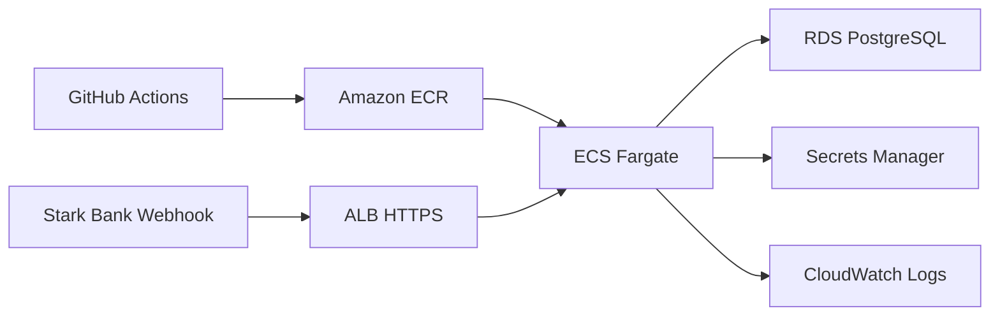

# Deploy AWS Opcional

Este documento descreve uma proposta de deploy opcional para demonstrar o Stark Bank Backend Trial na AWS. Ele não implementa IaC, não cria recursos e não contém valores sensíveis.

## Recomendação

Use ECS Fargate em vez de EKS para este case. A aplicação é um único serviço Spring Boot em container, sem necessidade de Kubernetes, service mesh ou control plane dedicado. Fargate reduz a operação para uma demo: publicar imagem, configurar task/service, expor HTTPS e conectar ao PostgreSQL gerenciado.

EKS faria sentido se o projeto já tivesse plataforma Kubernetes, múltiplos serviços, controllers, GitOps ou necessidade explícita de APIs Kubernetes. Para o bônus do trial, o custo operacional e cognitivo não compensa.

## Arquitetura Proposta

- ECR privado para armazenar a imagem Docker da aplicação.
- ECS Fargate com um service para o container Spring Boot.
- ALB público com listener HTTPS e certificado ACM.
- Target group apontando para a porta `8080` e health check em `/health`.
- RDS PostgreSQL em subnets privadas.
- Secrets Manager para credenciais e configurações sensíveis.
- CloudWatch Logs para stdout/stderr do container.
- GitHub Actions com OIDC para autenticar na AWS sem access keys long-lived.

Fluxo esperado:

## Secrets

Armazene secrets fora do repositório e injete no container em runtime:

- `STARKBANK_PRIVATE_KEY` como texto no Secrets Manager.
- `STARKBANK_PROJECT_ID` no Secrets Manager.
- `DATABASE_PASSWORD` no Secrets Manager.
- `DATABASE_URL`, `DATABASE_USERNAME`, `STARKBANK_ENVIRONMENT`, `INVOICE_SCHEDULER_ENABLED`, `INVOICE_INTERVAL_HOURS` e `INVOICE_MAX_BATCHES` como env vars não sensíveis ou parâmetros.

Não copie `.pem`, `.key` ou `.env` para a imagem. Em cloud, prefira `STARKBANK_PRIVATE_KEY` inline vindo do Secrets Manager e deixe `STARKBANK_PRIVATE_KEY_PATH` vazio.

## Custo e Liga/Desliga

- ECS service pode ficar com `desiredCount=0` quando a demo não estiver ativa.
- Para validar webhook e scheduler, subir temporariamente para `desiredCount=1`.
- RDS PostgreSQL pode ser parado/iniciado para reduzir custo, respeitando as limitações do RDS e o restart automático após período parado.
- ALB, storage, snapshots, logs e outros recursos podem continuar gerando custo mesmo com ECS desligado.
- Evite NAT Gateway na versão econômica. Uma alternativa simples é rodar tasks Fargate em public subnets com public IP, restringindo inbound pelo security group para aceitar tráfego apenas do ALB, e manter o RDS em private subnets.
- Em desenho mais próximo de produção, use private subnets para ECS com NAT Gateway ou VPC endpoints, aceitando maior custo.

Quando `desiredCount=0`, o webhook público não recebe eventos e o scheduler não roda.

## Scheduler em Cloud

Mantenha apenas uma task com `INVOICE_SCHEDULER_ENABLED=true`. Com mais de uma task ativa e scheduler habilitado, cada instância pode tentar emitir batches.

Para escala horizontal futura, escolha uma destas estratégias:

- desabilitar o scheduler nas réplicas com `INVOICE_SCHEDULER_ENABLED=false`;
- mover a emissão scheduled para um worker separado com `desiredCount=1`;
- adicionar lock distribuído antes de permitir múltiplas instâncias com scheduler habilitado.

## Plano Futuro de IaC e CI/CD

Uma próxima etapa pode adicionar Terraform em `infra/terraform` criando:

- VPC, subnets, route tables e security groups;
- ECR repository;
- ECS cluster, task definition e service;
- ALB, listener HTTPS, target group e health check;
- RDS PostgreSQL e subnet group;
- Secrets Manager secrets;
- IAM roles para task execution, task role e GitHub Actions OIDC;
- CloudWatch log group.

Workflows futuros:

- `deploy-aws.yml`: rodar testes, buildar imagem, publicar no ECR, registrar nova task definition e atualizar o ECS service.
- `scale-aws.yml`: workflow manual para alternar `desiredCount` entre `0` e `1`.

Também será necessário documentar certificado ACM/domínio, cadastro do webhook Stark Bank usando a URL HTTPS final e teardown dos recursos para controlar custo.
