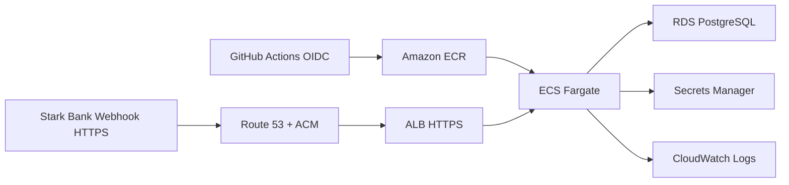

# Deploy AWS

Este documento descreve o provisionamento e a operação de deploy da versão AWS do Stark Bank Backend Trial. A arquitetura executada, os trade-offs, a segurança e as evidências operacionais estão detalhados em [aws-architecture.md](aws-architecture.md).

Os arquivos de infraestrutura e workflows não criam recursos automaticamente por simples leitura ou clone do repositório. `terraform apply` não deve ser executado sem aprovação explícita.

## Recomendação

Use ECS Fargate em vez de EKS para este case. A aplicação é um único serviço Spring Boot em container, sem necessidade de Kubernetes, service mesh ou control plane dedicado. Fargate reduz a operação para uma demo: publicar imagem, configurar task/service, expor HTTPS e conectar ao PostgreSQL gerenciado.

EKS faria sentido se o projeto já tivesse plataforma Kubernetes, múltiplos serviços, controllers, GitOps ou necessidade explícita de APIs Kubernetes. Para o bônus do trial, o custo operacional e cognitivo não compensa.

## Arquitetura

- ECR privado para armazenar a imagem Docker.
- ECS Fargate com service inicialmente em `desired_count=0`.
- Route 53 com hosted zone de `tavares-dev.com.br` e alias para o ALB.
- ACM com certificado TLS para `starkbank-trial.tavares-dev.com.br`.
- ALB público com HTTPS para o webhook e HTTP redirecionando para HTTPS.
- RDS PostgreSQL single-AZ em subnets privadas.
- Secrets Manager para credenciais sensíveis.
- CloudWatch Logs para stdout/stderr do container.
- GitHub Actions com OIDC para autenticar na AWS sem access keys long-lived.



## Preflight

Leia também [aws-preflight.md](aws-preflight.md).

Ferramentas esperadas:

```bash
terraform -version
aws --version
docker --version
git status
```

Autenticação AWS local recomendada:

```bash
aws configure sso --profile starkbank-trial
aws sso login --profile starkbank-trial

export AWS_PROFILE=starkbank-trial
export AWS_REGION=us-east-1
aws sts get-caller-identity
```

Use `AWS_PROFILE=starkbank-trial` e `AWS_REGION=us-east-1` nos comandos Terraform. Não use access key ou secret key hardcoded.

## Profiles

Existem dois conceitos separados:

- `AWS_PROFILE=starkbank-trial`: profile da AWS CLI usado por Terraform e comandos locais de provisionamento.
- `SPRING_PROFILES_ACTIVE=local` ou `SPRING_PROFILES_ACTIVE=aws`: profile da aplicação Spring Boot.

Para rodar localmente com scheduler desligado:

```bash
source ~/.starkbank/starkbank-trial.env
SPRING_PROFILES_ACTIVE=local SERVER_PORT=18080 INVOICE_SCHEDULER_ENABLED=false ./mvnw spring-boot:run
```

Para rodar localmente com scheduler ligado:

```bash
source ~/.starkbank/starkbank-trial.env
SPRING_PROFILES_ACTIVE=local SERVER_PORT=18080 INVOICE_SCHEDULER_ENABLED=true ./mvnw spring-boot:run
```

No ECS/Fargate, Terraform configura a aplicação com:

```text
SPRING_PROFILES_ACTIVE=aws
INVOICE_SCHEDULER_ENABLED=false
```

O profile `aws` usa variáveis de ambiente e ECS secrets para banco e Stark Bank. Não há secrets reais nos arquivos versionados.

## Terraform

A stack fica em `infra/terraform` e usa defaults seguros:

- `aws_region = "us-east-1"`;
- `desired_count = 0`;
- `spring_profiles_active = "aws"`;
- `invoice_scheduler_enabled = false`;
- sem NAT Gateway;
- ALB e ECS em subnets públicas;
- RDS em subnets privadas;
- ECS com public IP e inbound restrito ao ALB;
- HTTPS gerenciado por ACM quando `managed_https_enabled=true`;
- Route 53 habilitado quando `route53_zone_enabled=true`;
- sem valores sensíveis reais.

Comandos de revisão:

```bash
export AWS_PROFILE=starkbank-trial
export AWS_REGION=us-east-1

aws sts get-caller-identity
AWS_PROFILE=starkbank-trial AWS_REGION=us-east-1 terraform -chdir=infra/terraform validate
AWS_PROFILE=starkbank-trial AWS_REGION=us-east-1 terraform -chdir=infra/terraform plan
```

Não versionar `.terraform/`, `terraform.tfstate*`, `*.tfvars` reais, `tfplan` ou `plan.txt`.

Exemplo seguro de `terraform.tfvars` local, somente como referência:

```hcl
aws_region = "us-east-1"
name_prefix = "starkbank-trial"

desired_count = 0
image_tag = "latest"

spring_profiles_active = "aws"
invoice_scheduler_enabled = false
invoice_interval_hours = 3
invoice_max_batches = 8

certificate_arn = ""

root_domain_name = "tavares-dev.com.br"
app_domain_name = "starkbank-trial.tavares-dev.com.br"
route53_zone_enabled = false
preserve_root_email_block_records = true
managed_https_enabled = false
redirect_http_to_https = true

# Substitua SEU_IP_PUBLICO/32 antes de executar terraform plan.
allowed_http_cidr_blocks = ["SEU_IP_PUBLICO/32"]
allowed_https_cidr_blocks = ["0.0.0.0/0"]

starkbank_environment = "sandbox"
database_instance_class = "db.t4g.micro"

tags = {
  Project     = "starkbank-backend-trial"
  Purpose     = "demo"
  Environment = "sandbox"
  Owner       = "leandro"
}
```

## Secrets

O Terraform cria a estrutura dos secrets, mas não grava valores reais:

- `STARKBANK_PRIVATE_KEY`;
- `STARKBANK_PROJECT_ID`;
- `DATABASE_PASSWORD`, gerenciado pelo RDS.

Depois de um apply aprovado, preencha os secrets Stark Bank fora do repositório usando AWS Console, AWS CLI ou processo seguro equivalente. Em cloud, prefira `STARKBANK_PRIVATE_KEY` vindo do Secrets Manager e deixe `STARKBANK_PRIVATE_KEY_PATH` vazio.

## GitHub OIDC

O Terraform prepara uma role OIDC para GitHub Actions. Depois do apply, configure as variables do repositório:

- `AWS_REGION`;
- `AWS_ROLE_TO_ASSUME`;
- `ECR_REPOSITORY`;
- `ECS_CLUSTER`;
- `ECS_SERVICE`;
- `ECS_TASK_DEFINITION_FAMILY`;
- `ECS_CONTAINER_NAME`.

Não configure AWS access key ou secret key no GitHub.

## Deploy Manual

O workflow `.github/workflows/deploy-aws.yml` é manual via `workflow_dispatch`. Ele roda testes, builda a imagem Docker, publica no ECR, renderiza uma nova task definition e atualiza o ECS service.

O build publica duas tags no ECR:

- `${{ github.sha }}`: tag imutável usada no deploy ECS.
- `latest`: tag explícita para bootstrap da task definition inicial do Terraform.

O workflow também expõe inputs manuais para scheduler. Os defaults seguros são:

- `invoice_scheduler_enabled=false`;
- `invoice_max_batches=8`.

Alterar `invoice_scheduler_enabled` para `true` emite Invoices no Sandbox da Stark Bank. Use esse input apenas com o webhook HTTPS apontando para AWS, Project Stark AWS separado, webhook ngrok removido do Project AWS e uma única task ECS ativa.

Ele não roda em push. Antes de executar um deploy operacional, confirme:

- secrets Stark Bank preenchidos;
- role OIDC configurada no GitHub;
- RDS criado e acessível;
- domínio, Route 53, ACM e listener HTTPS validados;
- HTTP redirecionando para HTTPS quando `redirect_http_to_https=true`.

## Scale Manual

O workflow `.github/workflows/scale-aws.yml` também é manual. Use:

- `desired_count=0` para parar tasks ECS e reduzir custo de compute;
- `desired_count=1` para manter a demo ativa e receber webhooks depois que secrets e HTTPS estiverem prontos.

Com `desired_count=0`, o webhook fica indisponível e o scheduler não roda. Com `desired_count=1`, o scheduler continua desligado enquanto `INVOICE_SCHEDULER_ENABLED=false`.

## DNS, HTTPS e Webhook Stark

A configuração de domínio foi planejada em duas fases para evitar bloquear a validação ACM antes da delegação DNS. Na versão AWS validada, o domínio `starkbank-trial.tavares-dev.com.br`, a hosted zone Route 53, o certificado ACM, o listener HTTPS e o redirect de HTTP para HTTPS estão configurados.

Fase 1 cria apenas a hosted zone pública Route 53 para `tavares-dev.com.br`, preservando os registros raiz atualmente identificados:

- MX nulo;
- TXT SPF `v=spf1 -all`.

Depois do apply da Fase 1, copie os 4 nameservers do output `route53_name_servers` e configure-os manualmente no painel do registrador do domínio `tavares-dev.com.br`. Valide a propagação com:

```bash
dig +short NS tavares-dev.com.br
```

Na Fase 2, depois da propagação dos nameservers, `managed_https_enabled=true` cria:

- certificado ACM em `us-east-1` para `starkbank-trial.tavares-dev.com.br`;
- registros DNS de validação ACM no Route 53;
- validação ACM;
- listener HTTPS 443 no ALB;
- liberação de entrada 443 no security group do ALB;
- alias `A` do subdomínio para o ALB;
- redirect HTTP 80 para HTTPS 443 quando `redirect_http_to_https=true`.

HTTP no ALB existe apenas para smoke test técnico. Webhook público real da Stark deve apontar para uma URL HTTPS final:

```text
https://starkbank-trial.tavares-dev.com.br/webhooks/starkbank
```

Ngrok continua sendo uma ferramenta local/fallback para expor a aplicação em desenvolvimento. Ele não deve ficar na frente da AWS no teste end-to-end, porque adiciona uma dependência temporária e não valida o caminho final ALB HTTPS -> ECS.

Comandos de revisão da Fase 2:

```bash
AWS_PROFILE=starkbank-trial AWS_REGION=us-east-1 terraform -chdir=infra/terraform plan \
  -var='route53_zone_enabled=true' \
  -var='managed_https_enabled=true' \
  -var='root_domain_name=tavares-dev.com.br' \
  -var='app_domain_name=starkbank-trial.tavares-dev.com.br' \
  -var='redirect_http_to_https=true'
```

Na versão AWS, a URL de webhook validada é `https://starkbank-trial.tavares-dev.com.br/webhooks/starkbank`. Não mantenha a aplicação local/ngrok e a aplicação AWS processando webhooks ao mesmo tempo durante a bateria, e não deixe duas subscriptions `invoice` ativas apontando para ambientes diferentes.

## Scheduler em Cloud

O default da stack AWS é `INVOICE_SCHEDULER_ENABLED=false`, mesmo quando `desired_count` for alterado futuramente para `1`.

Mantenha apenas uma task ativa com `INVOICE_SCHEDULER_ENABLED=true`. Com mais de uma task ativa, cada instância pode tentar emitir batches.

Antes de habilitar o scheduler AWS, confirme:

- aplicação AWS saudável;
- `/health` respondendo em `https://starkbank-trial.tavares-dev.com.br/health`;
- RDS acessível e Flyway aplicado;
- secrets Stark Bank preenchidos no Secrets Manager;
- webhook da Stark apontando para `https://starkbank-trial.tavares-dev.com.br/webhooks/starkbank`;
- app local parado ou isolado para não processar os mesmos webhooks;
- ECS com `desired_count=1`;
- `INVOICE_MAX_BATCHES=8`.

Rollback operacional:

- primeiro publique nova task definition com `INVOICE_SCHEDULER_ENABLED=false`;
- mantenha a task viva para receber eventos pendentes;
- escale ECS para `desired_count=0` somente depois que os eventos cessarem;
- restaure o webhook da Stark para local/ngrok apenas se for necessário voltar ao fluxo local.

Para escala horizontal futura, escolha uma destas estratégias:

- desabilitar o scheduler nas réplicas;
- mover emissão agendada para um worker único;
- adicionar lock distribuído.

## Custos e Teardown

Mesmo com ECS em `desired_count=0`, estes itens podem gerar custo:

- ALB;
- RDS e storage;
- backups/snapshots;
- Secrets Manager;
- CloudWatch Logs;
- ECR storage.

RDS pode ser parado temporariamente pelo Console ou CLI, respeitando as limitações de restart automático da AWS. Para remover tudo, revise o estado Terraform e use `terraform destroy` apenas em uma etapa aprovada e consciente do impacto.
