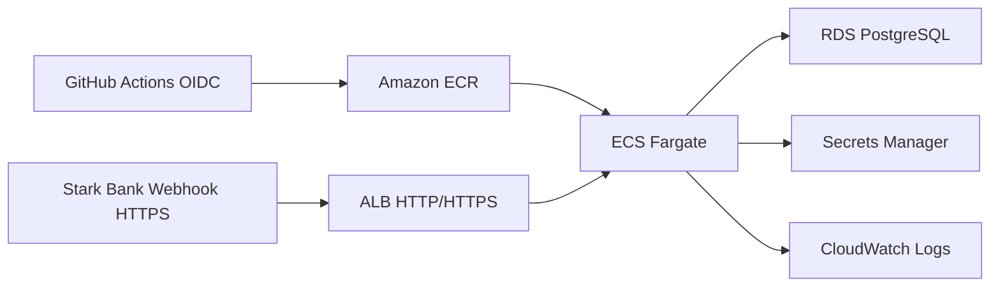

# Deploy AWS Opcional

Este documento descreve a stack AWS opcional do Stark Bank Backend Trial. Ela existe como preparação revisável de demo/bonus point: adiciona IaC, workflows manuais e documentação, mas não cria recursos automaticamente.

`terraform apply` não deve ser executado sem aprovação explícita.

## Recomendação

Use ECS Fargate em vez de EKS para este case. A aplicação é um único serviço Spring Boot em container, sem necessidade de Kubernetes, service mesh ou control plane dedicado. Fargate reduz a operação para uma demo: publicar imagem, configurar task/service, expor HTTPS e conectar ao PostgreSQL gerenciado.

EKS faria sentido se o projeto já tivesse plataforma Kubernetes, múltiplos serviços, controllers, GitOps ou necessidade explícita de APIs Kubernetes. Para o bônus do trial, o custo operacional e cognitivo não compensa.

## Arquitetura

- ECR privado para armazenar a imagem Docker.
- ECS Fargate com service inicialmente em `desired_count=0`.
- ALB público com HTTP apenas para smoke test técnico.
- Listener HTTPS opcional quando `certificate_arn` de ACM estiver disponível.
- RDS PostgreSQL single-AZ em subnets privadas.
- Secrets Manager para credenciais sensíveis.
- CloudWatch Logs para stdout/stderr do container.
- GitHub Actions com OIDC para autenticar na AWS sem access keys long-lived.



## Preflight

Leia também [aws-preflight.md](aws-preflight.md).

Ferramentas esperadas:

```bash
terraform -version
aws --version
docker --version
git status
```

Autenticação AWS local recomendada:

```bash
aws configure sso --profile starkbank-trial
aws sso login --profile starkbank-trial
aws sts get-caller-identity --profile starkbank-trial
```

Use `AWS_PROFILE=starkbank-trial` e `AWS_REGION=us-east-1` nos comandos Terraform. Não use access key ou secret key hardcoded.

## Terraform

A stack fica em `infra/terraform` e usa defaults seguros:

- `aws_region = "us-east-1"`;
- `desired_count = 0`;
- sem NAT Gateway;
- ALB e ECS em subnets públicas;
- RDS em subnets privadas;
- ECS com public IP e inbound restrito ao ALB;
- HTTPS opcional por `certificate_arn`;
- sem valores sensíveis reais.

Comandos de revisão:

```bash
AWS_PROFILE=starkbank-trial AWS_REGION=us-east-1 terraform -chdir=infra/terraform init
AWS_PROFILE=starkbank-trial AWS_REGION=us-east-1 terraform -chdir=infra/terraform validate
AWS_PROFILE=starkbank-trial AWS_REGION=us-east-1 terraform -chdir=infra/terraform plan -out=tfplan
terraform -chdir=infra/terraform show -no-color tfplan > plan.txt
```

Não versionar `.terraform/`, `terraform.tfstate*`, `*.tfvars` reais, `tfplan` ou `plan.txt`.

## Secrets

O Terraform cria a estrutura dos secrets, mas não grava valores reais:

- `STARKBANK_PRIVATE_KEY`;
- `STARKBANK_PROJECT_ID`;
- `DATABASE_PASSWORD`, gerenciado pelo RDS.

Depois de um apply aprovado, preencha os secrets Stark Bank fora do repositório usando AWS Console, AWS CLI ou processo seguro equivalente. Em cloud, prefira `STARKBANK_PRIVATE_KEY` vindo do Secrets Manager e deixe `STARKBANK_PRIVATE_KEY_PATH` vazio.

## GitHub OIDC

O Terraform prepara uma role OIDC para GitHub Actions. Depois do apply, configure as variables do repositório:

- `AWS_REGION`;
- `AWS_ROLE_TO_ASSUME`;
- `ECR_REPOSITORY`;
- `ECS_CLUSTER`;
- `ECS_SERVICE`;
- `ECS_TASK_DEFINITION_FAMILY`;
- `ECS_CONTAINER_NAME`.

Não configure AWS access key ou secret key no GitHub.

## Deploy Manual

O workflow `.github/workflows/deploy-aws.yml` é manual via `workflow_dispatch`. Ele roda testes, builda a imagem Docker, publica no ECR, renderiza uma nova task definition e atualiza o ECS service.

Ele não roda em push e não deve ser usado antes de:

- secrets Stark Bank preenchidos;
- role OIDC configurada no GitHub;
- RDS criado e acessível;
- decisão final de HTTPS/domínio/certificado.

## Scale Manual

O workflow `.github/workflows/scale-aws.yml` também é manual. Use:

- `desired_count=0` para parar tasks ECS e reduzir custo de compute;
- `desired_count=1` para manter a demo ativa, receber webhooks e rodar o scheduler.

Com `desired_count=0`, o webhook fica indisponível e o scheduler não roda.

## HTTPS e Webhook Stark

HTTP no ALB existe apenas para smoke test técnico. Webhook público real da Stark deve apontar para uma URL HTTPS.

Ainda está pendente definir:

- domínio;
- DNS editável ou hosted zone Route 53;
- certificado ACM validado;
- valor final de `certificate_arn`.

Depois de definir HTTPS, atualize a URL do webhook na Stark para o endpoint final.

## Scheduler em Cloud

Mantenha apenas uma task ativa com `INVOICE_SCHEDULER_ENABLED=true`. Com mais de uma task ativa, cada instância pode tentar emitir batches.

Para escala horizontal futura, escolha uma destas estratégias:

- desabilitar o scheduler nas réplicas;
- mover emissão agendada para um worker único;
- adicionar lock distribuído.

## Custos e Teardown

Mesmo com ECS em `desired_count=0`, estes itens podem gerar custo:

- ALB;
- RDS e storage;
- backups/snapshots;
- Secrets Manager;
- CloudWatch Logs;
- ECR storage.

RDS pode ser parado temporariamente pelo Console ou CLI, respeitando as limitações de restart automático da AWS. Para remover tudo, revise o estado Terraform e use `terraform destroy` apenas em uma etapa aprovada e consciente do impacto.
